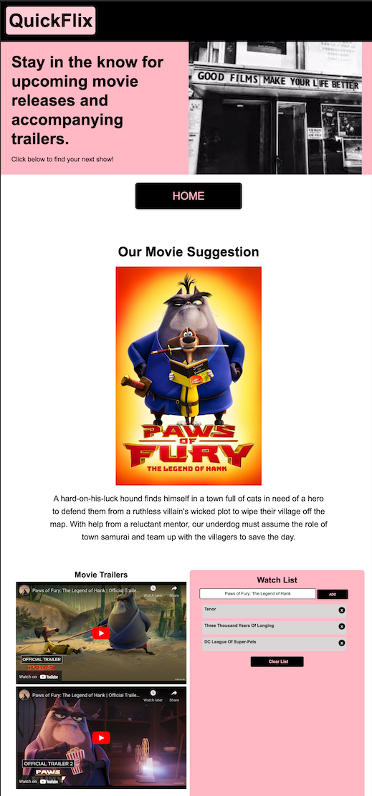

# **QuickFlix** 

## **Description** 
This application helps users to find movies either currently in theaters, or coming to theaters soon. It will offer 3 trailers of the movie displayed along with a watch list the user can choose to add the movie to. 

## **Features** 
* When the 'Find Me a Movie' button is clicked, the Movie Database API is accessed. 
* When the Movie Database API is accessed, it will randomly generate a movie suggestion to the user. 
* When the movie suggestion is randomly generated, the suggestion will appear on the screen by displaying a poster and description of the movie. The random movie suggestion is also placed into the YouTube API.
* When the YouTube API is called, it will display 3 trailers of the movie suggestion for the user to watch. 
* The random movie suggestion will also automatically appear in the watch list for the user to choose to add, or forgo. 
* When the add button on the watch list is clicked, it will add it to the watch list and add it to local storage. 
* When the 'x' next to the movie suggestion on the list is clicked, it will delete it from the list, along with remove it from local storage. 
* When the home button is clicked, the user is taken back to the main page where they can get another movie suggestion. 
* When the user gets another movie suggestion, their watch list movies from local storage will still be there, if they have not been cleared.  
 

## **Technologies Used** 
### CSS Framework 
* MD Bootstrap was used to assist in styling the application. 

### API's 
* The Movie Database was used to retrieve the movie suggestion. You can find more information on this API by clicking [HERE](https://www.themoviedb.org/documentation/api?language=en-US). 
* The YouTube API was used to display movie trailers to the user. You can find more infomation on this API by clicking [HERE](https://developers.google.com/youtube/v3).  
 

## **Links to Application** 
* Link to application: https://mich-hales.github.io/QuickFlix/ 
* Link to GitHub: https://github.com/mich-hales/QuickFlix   
 

## **Mock-up** 
 

